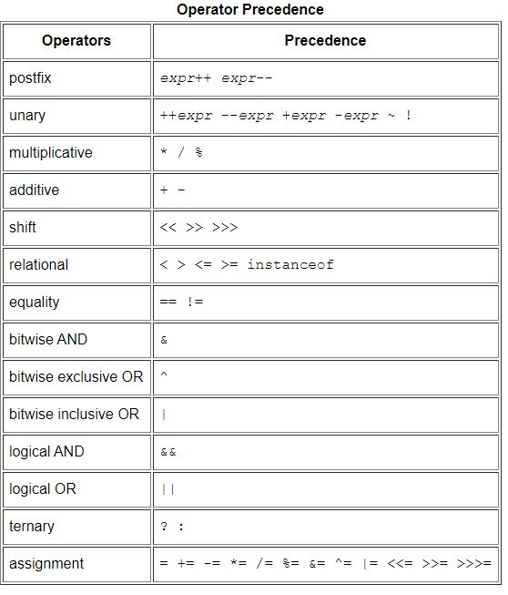

# Operators
https://docs.oracle.com/javase/tutorial/java/nutsandbolts/operators.html  
Sú to špecialne symboly, ktoré slúžia na vykonanie konkrétnej operácie. Následne vrátia naspäť výsledok 
Prednosť jednotlivých operatorov sa **líši**. Tie ktoré sú prednejšie (inak povedané majú väčšiu váhu),
sú vykonávané pred tými ktoré sú pod nimi. Tabuľka je usporiadaná od najvyššej po najnižšiu.
Ak sú operatory v rovnakom riadku, majú rovnakú prednosť. Všetky binárne operátory sú vykonávané z ľava do prava. Priraďovacie sú vykonávané z prava do ľava. 

